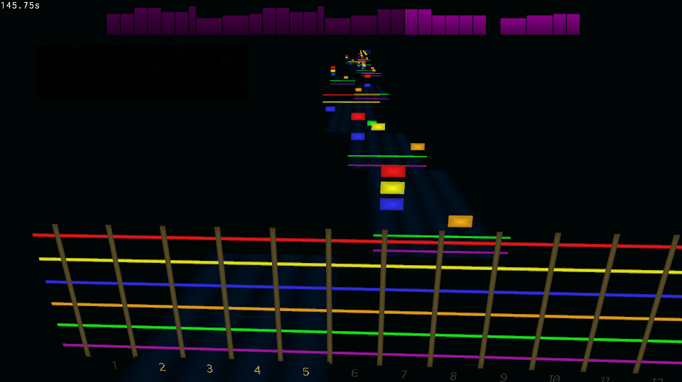

Opensmith - free guitar learning game.
It aims to fix Rocksmith shortcomings: drop the branded cable requirement, add ASIO support, improve interface responsiveness and loading times.

Dependencies:
* [glfw](https://github.com/glfw/glfw) - window creation
* [glew](https://github.com/nigels-com/glew) - OpenGL extension loader
* [glm](https://github.com/g-truc/glm) - matrix math
* [gli](https://github.com/g-truc/gli) - texture loader
* [zlib](http://www.zlib.net/) - psarc entries unpacker
* [portaudio](http://www.portaudio.com/) - audio API
* [ogg](https://xiph.org/ogg/) - song container
* [vorbis](https://xiph.org/vorbis/) - song codec
* [dirent](https://github.com/tronkko/dirent) - filesystem api
* [tinyxml2]( https://github.com/leethomason/tinyxml2) - song XML parsing

Building: cmake

Usage:
Put .psarc song files into `resources/dlc` directory. You can use official Rocksmith DLCs as well as [custom](https://github.com/rscustom/rocksmith-custom-song-toolkit) DLCs, PC or Mac format.
After that change directory to `bin` and run `opensmith`. Use `-f` switch to run fullscreen. Select setup first to choose input and output audio devices. Then pick a song, tune and have fun.

